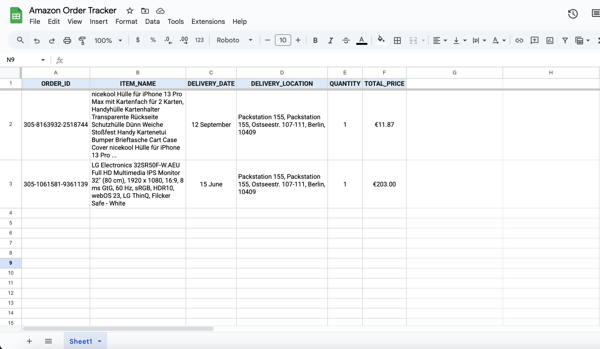

## 🧩 Project Overview
Built for learning purposes on **self-hosted n8n version 1.113.3**.  
The workflow simulates an incoming **Amazon.de order confirmation email** using a **Set node**, extracts key fields with a **Code node**, and appends them to a **Google Sheet**.  
In production, the Set node can be replaced with a **Gmail Trigger**.

---

## ⚙️ What It Does
Takes an incoming email → extracts order information → writes a new row to Google Sheets.

**Example of the Amazon Order Tracker Google Sheet:**  

---

## 🚀 Setup Instructions

### 1. Import the Workflow
- Open your **n8n instance**.  
- Click **Import Workflow** and upload `Amazon Order Tracker (Demo).json`.

### 2. Create Your Google Sheet
- Copy the template here:  
  👉 [Amazon Order Tracker Template (Google Sheets)](https://docs.google.com/spreadsheets/d/10n5DmwhjZRIPYMYSMSva0D5rLdWQN3yngD8E9PI0JfY/edit?usp=sharing)  
- Go to **File → Make a copy**.  
- Copy your **Sheet ID** from the URL.

### 3. Connect Google Sheets
- Open the **Google Sheets node** in n8n.  
- Add your **Google account** as a new credential.  
- Ensure the **Google Sheets API** and **Google Drive API** are enabled in your Google Cloud project.  
- Paste your **Sheet ID** into the node configuration.  
- Click **Execute Node** to test the connection.

### 4. Test the Workflow
- Use the included `example_email.txt` as the input in the **Set node**.  
- Execute the workflow.  
- Verify that the extracted order data appears in your Google Sheet.

---

### Workflow Overview

Below is the n8n workflow structure used for this project:

---

## ⚠️ Limitations
- Works with **one product type per order** (quantity > 1 is supported).  
- Tested with **Amazon.de confirmation emails** (2025 layout).  
- Other regional or older templates may require small adjustments.
